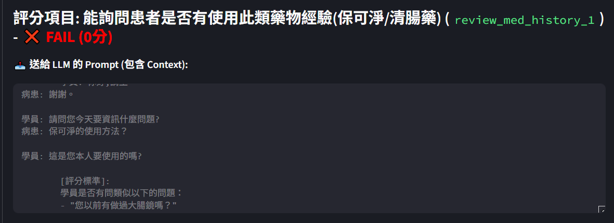
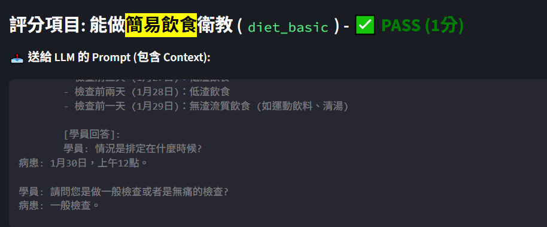

在這裡 錯的事能詢問患者是否有使用此類藥物經驗
這裡prompt的評分標準應該要改成 檢查上述對話的語義 看學員有沒有詢問患者有沒有用過保可淨/清腸藥

然後是關於AI的回應(病患) 最好把他的標點符號拆掉 應該說過濾掉 ? 跟 !

在 能做飲食簡易衛教這一項 的prompt 有問題
這裡在寫評分標準的怪怪的 感覺會讓模型誤以為有講日期就正確了
還有就是搜尋不到 那就是待辦的最重要的一項

        你是一個資深護理師，請判斷學員的衛教內容是否正確。

        [正確的飲食時程表]:
        - 檢查前三天 (1月27日)：低渣飲食
        - 檢查前兩天 (1月28日)：低渣飲食
        - 檢查前一天 (1月29日)：無渣流質飲食 (如運動飲料、清湯)

        [學員回答]: 
        學員: 情況是排定在什麼時候?
病患: 1月30日，上午12點。

學員: 請問您是做一般檢查或者是無痛的檢查?
病患: 一般檢查。

學員: 所以目前醫生幫我們安排長徑檢查,是排一般的檢查,排定時間是1月30日上午12點。
        
        [評分標準]:
        請判斷學員是否正確說明了上述兩個階段的飲食原則（低渣 vs 無渣流質）。
        
        [寬容度說明]:
        1. 學員可以使用「具體日期」(如1月27日)。
        2. 學員也可以使用「相對日期」(如 "檢查前三天"、"前兩天"、"明天/後天")。
        3. 只要學員講出的邏輯符合上述時程表，就請給分。

        如果飲食觀念與時程正確，只輸出 "1"。如果不正確，只輸出 "0"。
        

語音修正部分
長徑 -> 腸淨
腸刀 -> 腸道
